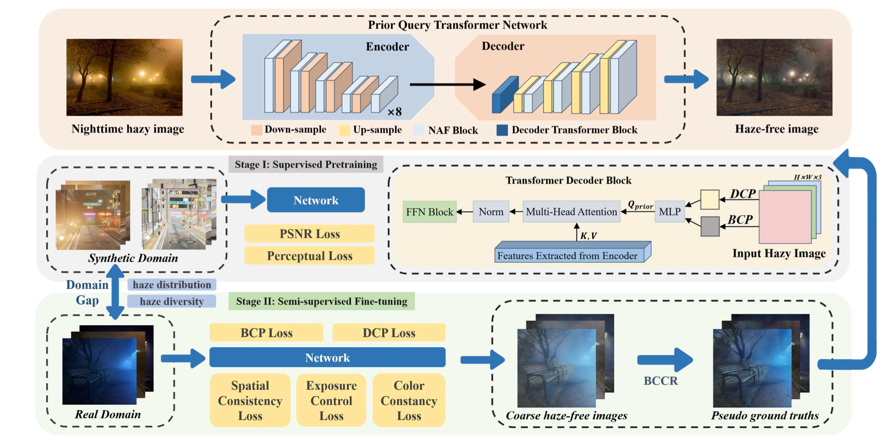
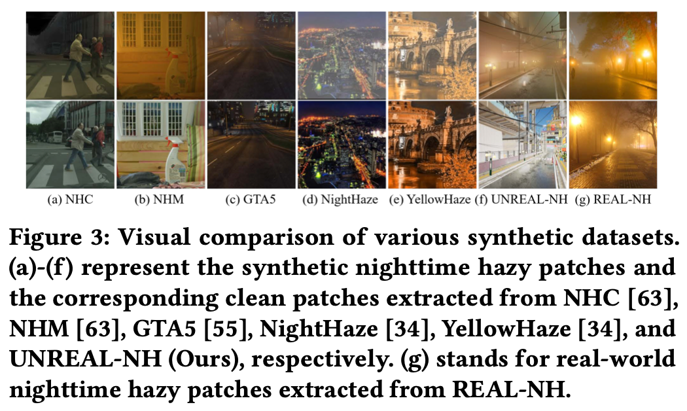
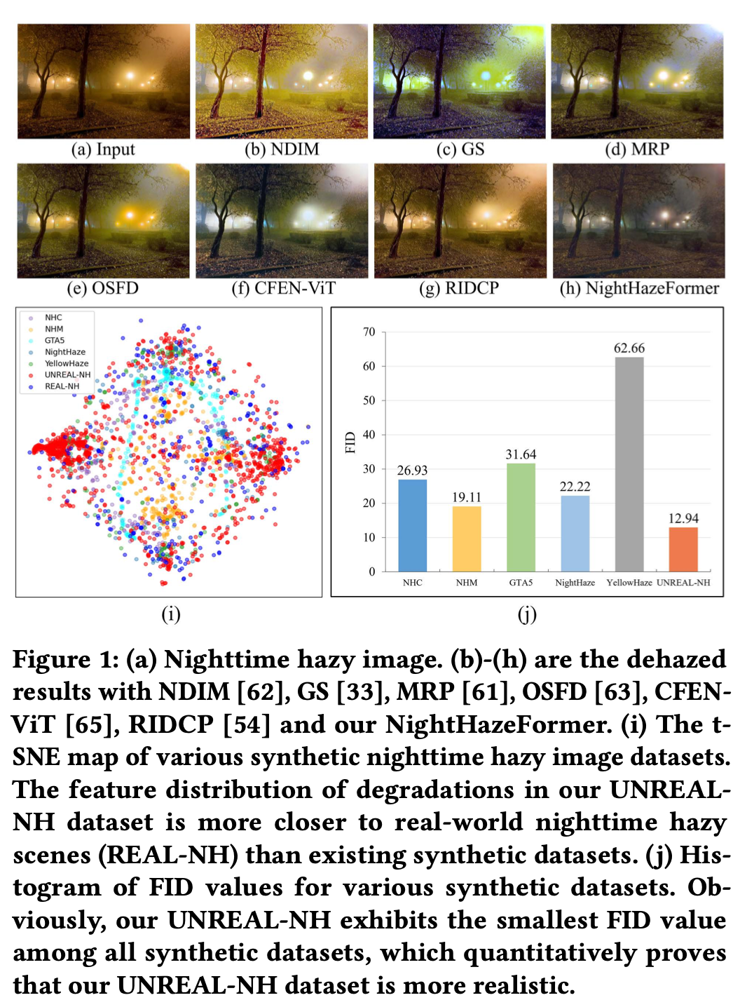

# NightHazeFormer
This is the office repository of ***NightHazeFormer: Single Nighttime Haze Removal Using Prior Query Transformer, ACM MM 2023.***

**Authors: [Yun Liu](https://scholar.google.com/citations?user=9fjHp-EAAAAJ&hl=en), Zhongsheng Yan，[Sixiang Chen](https://scholar.google.com/citations?user=EtljKSgAAAAJ&hl=en), [Tian Ye](https://owen718.github.io)，[Wenqi Ren](https://sites.google.com/view/wenqiren/homepage)，[Erkang Chen](https://scholar.google.com/citations?user=hWo1RTsAAAAJ&hl=en).**

[Arxiv](https://arxiv.org/pdf/2305.09533.pdf)

## Abstract
***Nighttime image dehazing is a challenging task due to the presence of multiple types of adverse degrading effects including glow, haze, blur, noise, color distortion, and so on. However, most previous studies mainly focus on daytime image dehazing or partial degradations presented in nighttime hazy scenes, which may lead to unsatisfactory restoration results. In this paper, we propose an end-to-end transformer-based framework for nighttime haze removal, called NightHazeFormer. Our proposed approach consists of two stages: supervised pre-training and semi-supervised fine-tuning. During the pre-training stage, we introduce two powerful priors into the transformer decoder to generate the non-learnable prior queries, which guide the model to extract specific degradations. For the finetuning, we combine the generated pseudo ground truths with input real-world nighttime hazy images as paired images and feed into the synthetic domain to fine-tune the pre-trained model. This semisupervised fine-tuning paradigm helps improve the generalization to real domain. In addition, we also propose a large-scale synthetic dataset called UNREAL-NH, to simulate the real-world nighttime haze scenarios comprehensively. Extensive experiments on several synthetic and real-world datasets demonstrate the superiority of our NightHazeFormer over state-of-the-art nighttime haze removal methods in terms of both visually and quantitatively.***

<!--  -->

## TODO List
- [ ] Release Dataset
- [ ] Release Enhancement Results of NightHazeFormer

